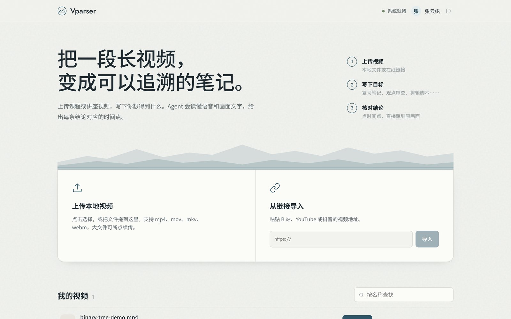
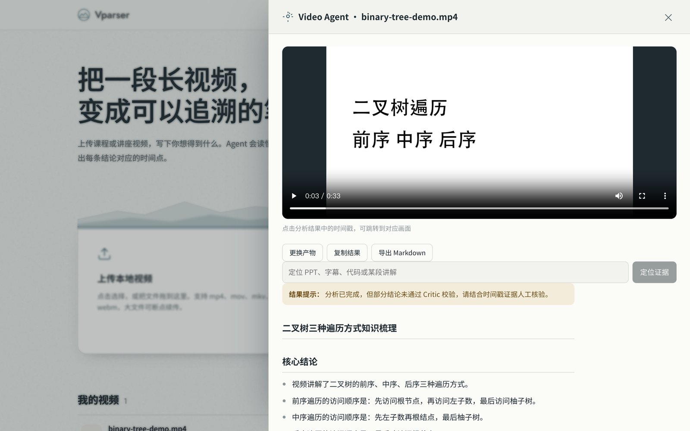
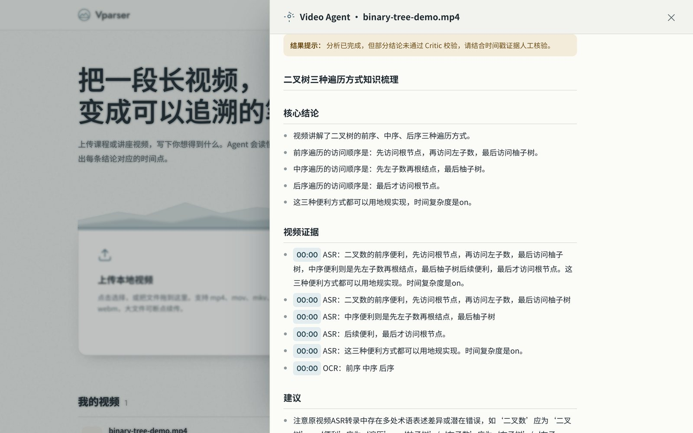
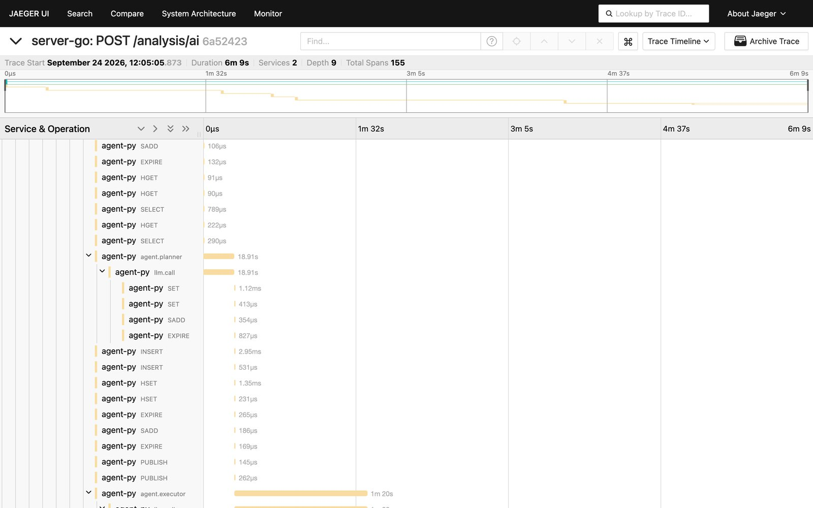

<div align="center">
  <h2>Vparser</h2>
  <p>
    
    
    
    
    
    
    <a href="./LICENSE"></a>
  </p>
  <p>面向长视频内容理解的 <strong>Video Agent</strong>：把几个小时的课程、讲座变成可检索、可追溯、可以继续追问的结构化笔记。</p>
</div>

## 它能做什么

上传一段视频（本地文件或在线链接），写下你想得到的东西，比如复习笔记、观点审查、剪辑脚本。Agent 会读懂语音和画面文字，给出结构化结果，**每条结论都带时间戳**，点一下就跳回原画面核对。结果之后还能继续追问。

## 界面预览

**工作台**：上传本地视频或导入链接（支持秒传与断点续传），管理自己的视频。



**分析结果**：原视频与结构化结论并排，点击时间戳即可跳回对应画面。



**时间戳证据**：每条结论都绑定可核验的 ASR / OCR 原文；未通过 Critic 校验的结果会明确提示。



**全链路追踪**：一次分析是一条跨 server-go 与 agent-py 的 trace（本例 155 个 span），Planner、Executor 与每次模型调用的耗时一目了然。



## 架构

```
浏览器 ──HTTP/SSE──► nginx ──► server-go (Go) ──gRPC──► agent-py (Python)
                                 │  鉴权 · 秒传/分片上传 · 限流 · 幂等
                                 │  Kafka 生产与消费（分级重试 + DLQ）
                                 │  分布式锁 · VideoContext 构建（FFmpeg / ASR / OCR）
                                 ▼
          MySQL · Redis · Kafka · MinIO · Qdrant · Jaeger · Prometheus
```

- **server-go**：对外的全部接口，负责接入、调度和重 I/O 的多模态预处理。
- **agent-py**：Planner → Executor → Critic 受控工作流、检索、证据校验、预算与 Checkpoint，只在内网提供 gRPC 服务。
- 服务之间的契约见 [`proto/agent/v1/agent.proto`](proto/agent/v1/agent.proto) 和 [`docs/architecture.md`](docs/architecture.md)。

## 核心设计

**可靠的任务链路**
- 秒传：Web Worker 计算整文件 MD5，服务端再随机抽一段字节做挑战校验，防止拿到别人视频的 MD5 就能“秒传”冒领。
- 分片上传 + 断点续传：5MB 分片，Redis Set 记录进度，合并阶段加锁。
- Kafka 异步化：幂等生产者 + `acks=all`；按内容哈希分区；手动提交 offset；10s / 60s 两级重试 topic，最后进 DLQ。
- 自研 Redis 分布式锁：`SET NX PX` + 看门狗续期 + Lua 比对删除 + 丢锁感知。
- 多层去重：提交幂等 key、消费互斥锁、同内容同目标结果复用、同内容上下文复用。
- Redis Lua 令牌桶：用户级与全局两级限流。

**时序多模态 VideoContext**
- 音频按 60 秒切片做 ASR；画面按场景变化抽关键帧，另加 30 秒保底，再用差异哈希去重后做 OCR。
- 两路用 goroutine + 有界 worker 池并行，合并成统一的时间轴片段。

**受控 Agent**
- Planner → Executor → Critic 最多两轮，之后再用代码逐条核验证据：时间戳是否落在片段内、原文能否在 ASR/OCR 中找到。
- 时长、Token、成本三重预算；gRPC deadline 一路传到 Agent，限制它的执行时长。
- 长视频按 5 分钟分块，做摘要、关键词与 bge-m3 向量；语义 + 关键词 + 画面文字三路加权检索；Qdrant 不可用时自动降级。
- 阶段级 Checkpoint（MySQL 真源 + Redis 缓存），失败后从最近完成的阶段恢复。
- 追问走轻量链路：检索 + 单轮有据回答，并核验引用的时间戳。

**可观测性**
- OpenTelemetry 全链路追踪：HTTP → Kafka → gRPC → 模型调用，一次分析在 Jaeger 里是一条完整的 trace。
- Prometheus 指标：接口延迟、提交结果、消费耗时、重试 / DLQ、锁竞争、模型延迟与 Token 用量、Critic 通过率、预算终止次数。
- 前端通过 SSE + Redis Pub/Sub 实时接收任务阶段，支持多实例。

## 快速开始

只需要安装并启动 Docker Desktop：

```bash
./scripts/start.sh   # 首次运行会生成 .env 并询问硅基流动 API Key；全部服务健康后自动打开浏览器
./scripts/stop.sh    # 停止（数据保留）
```

| 地址 | 内容 |
|---|---|
| http://localhost:8080 | Web 工作台 |
| http://localhost:16686 | Jaeger 链路追踪 |
| http://localhost:19090 | Prometheus |

脚本会自动避开被占用的端口，实际地址以脚本输出为准。可以用 `docs/samples/binary-tree-demo.mp4`（30 秒示例视频）体验，一次分析大约需要 1 到 3 分钟，取决于模型响应速度。

### 本地开发

```bash
cp .env.example .env                   # 填写密码与 SILICONFLOW_API_KEY
./scripts/dev-up.sh                    # 只启动中间件（MySQL/Redis/Kafka/MinIO/Qdrant/Jaeger/Prometheus）
set -a; source .env; set +a
(cd agent-py && uv run python -m app.server) &
(cd server-go && go run ./cmd/server) &
(cd client && npm ci && npm run dev)   # http://localhost:5173
```

修改 `proto/` 后，执行 `./scripts/gen-proto.sh` 重新生成 Go 和 Python 的桩代码（生成代码随仓库提交，CI 会检查是否与 proto 一致）。

## 目录结构

```text
Vparser
├── proto/               # gRPC 契约（唯一真源）
├── server-go/           # Go 网关：HTTP API、Kafka、锁、限流、VideoContext 构建
├── agent-py/            # Python Agent：工作流、检索、证据校验、Checkpoint
├── client/              # Vue 3 工作台（nginx 托管）
├── deploy/              # Prometheus 配置
├── docs/                # 架构与契约、示例视频
├── scripts/             # 一键启动、停止、中间件、生成桩代码
└── docker-compose.yml
```

## 测试

```bash
(cd server-go && go test -race ./...)
(cd agent-py && uv run pytest)
(cd client && npm test && npm run build)
```

## License

[MIT](LICENSE)
